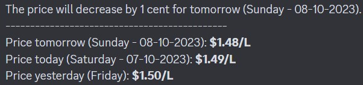

# Fuel Price Tracker in the Greater Toronto Area (GTA)

## About the Project

This project is a Python script designed to monitor and track price changes in the Greater Toronto Area (GTA). Utilizing Selenium WebDriver for web scraping, the script extracts the current, previous, and upcoming prices and processes the data to determine the price trend. It then sends formatted notifications to a Discord channel via a webhook. This script can be scheduled to run at desired intervals (using Windows Task Scheduler), providing timely updates on price fluctuations aiding in informed decision-making.

This project is the spiritual successor of the original gas scraper project found [here](https://github.com/JacYuan1/Gas-Price-Scraper-Project) as it is much more accurate and secure than the previous project.

## Installation Requirements

Here are all the required links to install onto your machine before you run the code:

1. https://www.python.org/downloads/
2. https://pip.pypa.io/en/stable/installation/#
3. https://pypi.org/project/requests/
4. https://pypi.org/project/selenium/ ([Can also download Selenium from the offical website](https://www.selenium.dev/documentation/webdriver/))
5. https://discord.com/download

## Setup

Follow these steps to get the project up and running:

### 1. Install the necessary packages
   Download and install the required packages listed above.

### 2. Configure Environment Variable
   Set up your environment variable for the Discord webhook URL as well as the webhook itself. The variable name used in the code is `WEBHOOK_URL`.
   - **Help with Discord Webhook:** If you need help setting up a Discord webhook, check out this [article](https://support.discord.com/hc/en-us/articles/228383668-Intro-to-Webhooks).
   - **Help with Environment Variables:** If you need help setting up an environment variable, check out this [article](https://www3.ntu.edu.sg/home/ehchua/programming/howto/Environment_Variables.html).

### 3. Schedule the Script
   Set up the script to run automatically at a desired time.
   - **Windows:** Use the Windows Task Scheduler. Here's a [video guide](https://www.youtube.com/watch?v=ic4lUiDTbVI) on how to do that.
   - **Mac/Linux:** Use Cron job.

## Example Output

Here is an example output on a Discord channel:

## Additional Information

To add it to other comptuers, you can use convert this into a executable file using [auto-py-to-exe](https://github.com/brentvollebregt/auto-py-to-exe).
